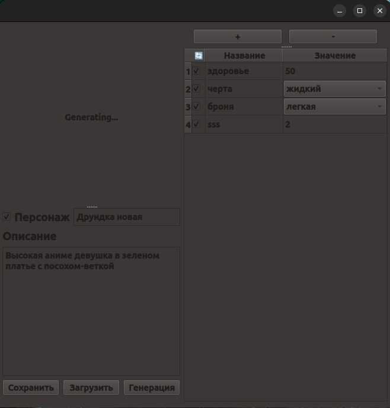
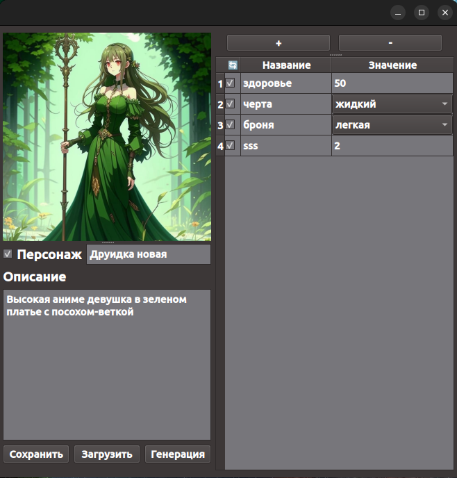
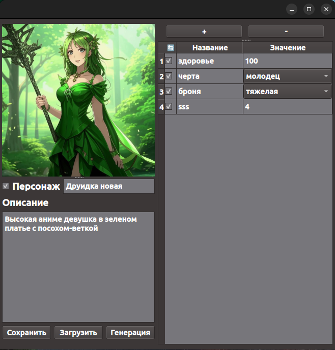
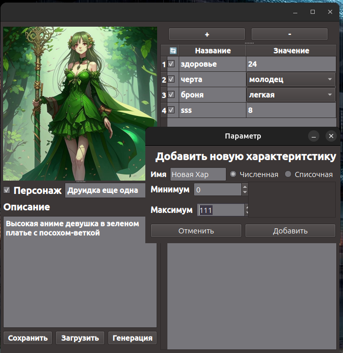
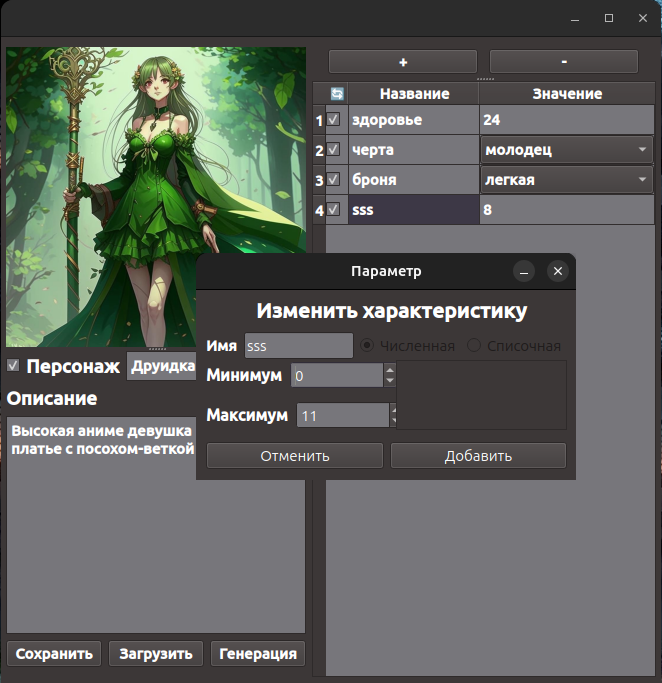

***Примечание*** данный проект был придуман и разработан в рамках хакатона №2 на Discord сервере OE

# Stat Generator

## Начало работы

### Исходный код

Из корня зайти в папку src и там запустить файл `__main__.py`
при этом установив все библиотеки из `requirements.txt`.

### Linux

Из корня нужно зайти в папку `dist_linux` и запустить `StatGen`

### Windows

Сразу хочу отметить, что изначально приложение была задизайнена под Linux, поэтому на Windows возможны некоторые
проблемы с цветами, и в целом внешний вид UI отличается.

Из корня нужно зайти в папку `dist_windows` и запустить `StatGen.exe`

## Краткое описание

Данный проект представляет собой QT приложение для гибкой настройки профилей генерации характеристик чего и кого угодно.
Вы можете выбрать из двух типов характеристик: выпадающий список или числовое значение. Каждую из опций вы можете
зарандомить, а можете настроить вручную. Вы можете менять и саму конфигурацию характеристик двойным нажатием по имени
необходимой характеристике. Галочками в первой колонке таблицы вы можете выбрать какие именно характеристики вы хотите
зарандомить.

Также вы можете добавлять собственные характеристики и удалять существующие по нажатию на `+` и `-`
на `+` откроется доп. меню. где вы сможете настроить новую характеристику.

Одной из приятных (по моему мнению) фич является интегрированный Kandinskiy, ведь с помощью его вы сразу сможете
получить микро портретик вашего персонажа по описанию. Конечно, это опционально. Вы запросто можете убрать галочку рядом
с именем вашего персонажа и генерации не будет.

Вы можете экспортировать и импортировать ваших персонажей в json соответствующими кнопками. В json вносится вся
информация о текущем состоянии генератора, поэтому сохранятся не только характеристики персонажа, но и их полная
конфигурация.

**Сумбурная видео-демонстрация:** `gallery/demo.mp4`

## Галерея с тестов

Во время генерации...

Генерация 1

Генерация 2

Добавление новой характеристики

Изменение характеристики
